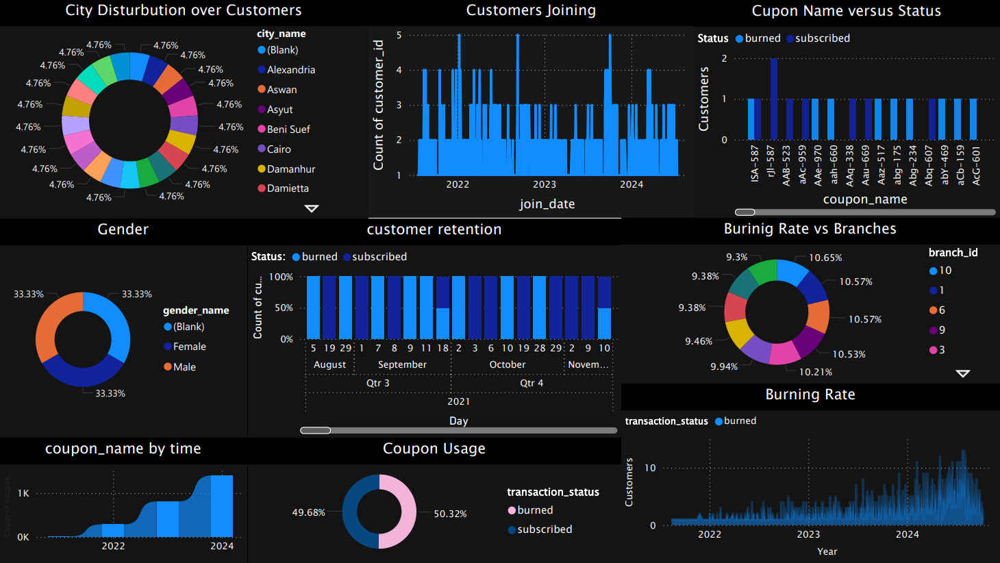

# Customer Segmentation for Coupons 🎯

This project focuses on analyzing e-commerce customer behavior through interactive Power BI dashboards and customer segmentation using unsupervised learning techniques. The dashboard provides key insights on demographics, coupon usage, and branch performance, while the clustering model helps identify customer groups to optimize coupon strategies and enhance loyalty.

* # Power BI Dashboard Overview 📊

This Power BI dashboard offers an insightful breakdown of coupon usage and customer segmentation through various visualizations:

* Pie Charts:

Gender Distribution: The first pie chart shows an equal distribution between male and female customers ⚖️.

City Distribution: The second pie chart reveals that all cities are equally represented 🌍.

Burning Rate vs. Branches: The third pie chart highlights Branch 10 having the highest coupon burning rate 🔥.

Coupon Status: The fourth pie chart indicates that burned coupons slightly outnumber active ones 💥.

* Stacked Area Chart:

Visualizes the Coupon ID usage over time, showing trends in coupon activity 📊.

* Line Charts:

Burning Rate Over Time: Tracks how the burning rate fluctuates over different periods ⏳.
Customer Joining Rate: Demonstrates customer growth, providing insights into customer engagement 📈.

* Stacked Bar Charts:

Coupon Status by Customer: Depicts how different customers' coupon statuses have evolved over time 👥.

Coupon Names: A similar breakdown of coupon statuses according to specific coupon names 🏷️.

# Data Processing and Feature Engineering 🚀

For the data processing part of the project, the dataset initially consisted of six tables: customers, genders, cities, transactions, branches, and merchants. To streamline the data, I merged the relevant sheets: customers with genders and transactions with cities. After merging, the dataset had features like customer_id, join_date, gender_name, city_name, and various transaction details. 📊

* During the cleaning process:

I handled null values by dropping burn_date for transactions not marked as "burned" since they made up half the dataset. Additionally, 11 rows with null values were dropped as they were insignificant. 🗑️

* Feature engineering was performed by creating two new features:

* Total Transactions per Customer 💳

* Coupon Usage Count per Customer 🏷️

To reduce redundancy, I dropped columns like customer_id, city_name, gender_name, coupon_name, and transaction_id, since their respective IDs provided the same information. 🔄
Afterward, I applied Label Encoding for categorical features and scaled numerical values, making the dataset ready for model training. ⚙️

# Modeling and Evaluation 🧠🔍

In the modeling phase, I tested five clustering algorithms: K-Means, DBSCAN, MeanShift, Gaussian Mixture, and Agglomerative Clustering. After evaluating their performance, I determined that Cluster 3 provided the most reasonable balance between accuracy and business relevance.

**_Silhouette Scores Summary:_**

* KMeans: 0.2933

* Gaussian Mixture: 0.2446

* Agglomerative: 0.2927

Next, I applied Principal Component Analysis (PCA) with 10 components and reassessed the models:

* KMeans: 0.2926

* Gaussian Mixture: 0.2396

* Agglomerative: 0.29488

Best Model: Gaussian Mixture stood out as the best clustering model with a silhouette score of 0.298.

For supervised learning, I initially used five classifiers without hyperparameter tuning:

* Random Forest
* Naive Bayes
* SVM
* Decision Tree
* XGBoost

All models achieved high accuracy (~99%), but their learning curves varied. Naive Bayes and SVM displayed more balanced learning curves, so I performed hyperparameter tuning with Optuna to enhance these models. The final model chosen based on optimal learning curves was the SVM.

Final Notes:

Supervised Learning: Best accuracy with SVM (99%)

Unsupervised Learning: Best clustering with Gaussian Mixture (Silhouette Score: 0.298)

